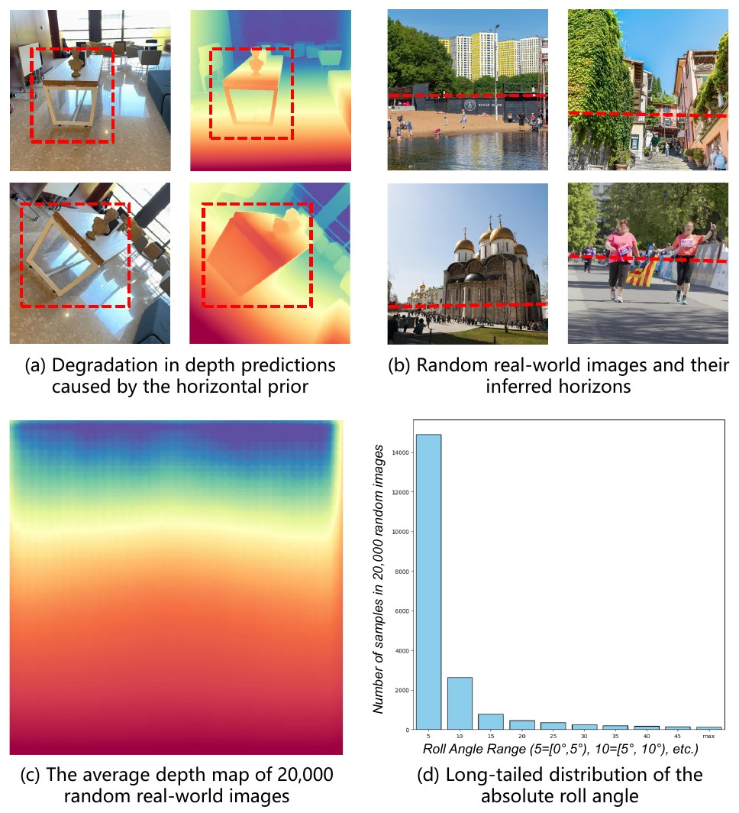
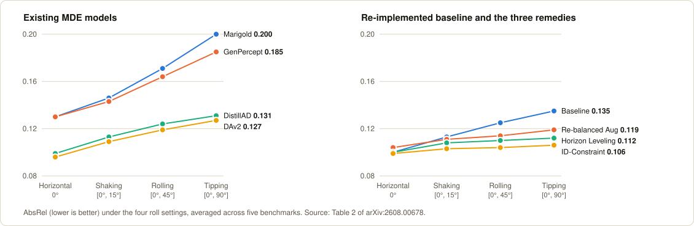
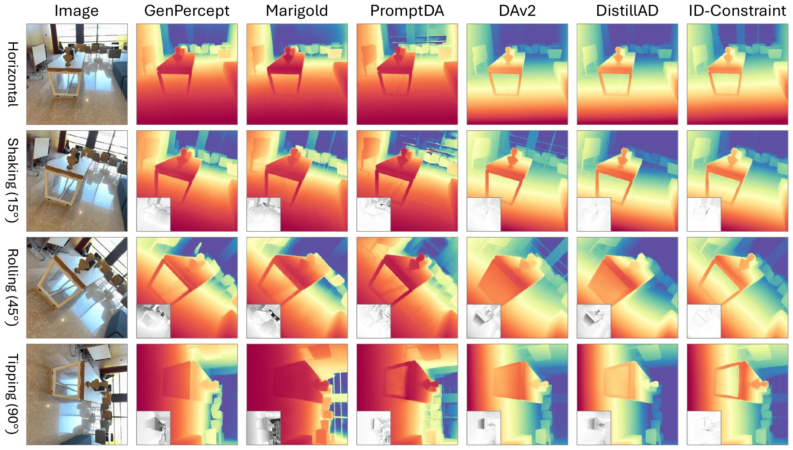
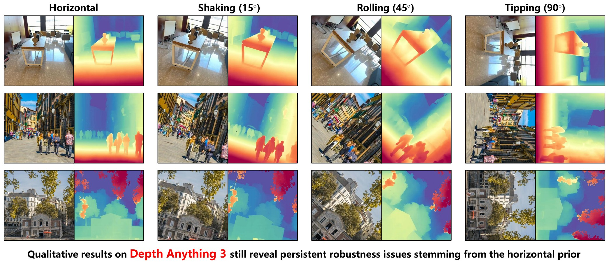
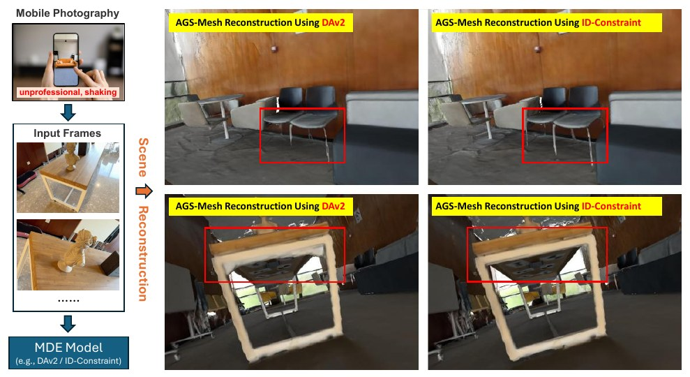
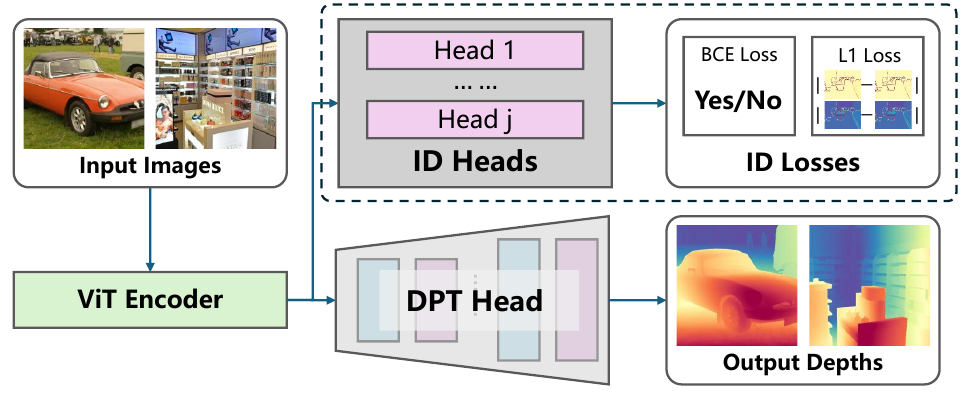
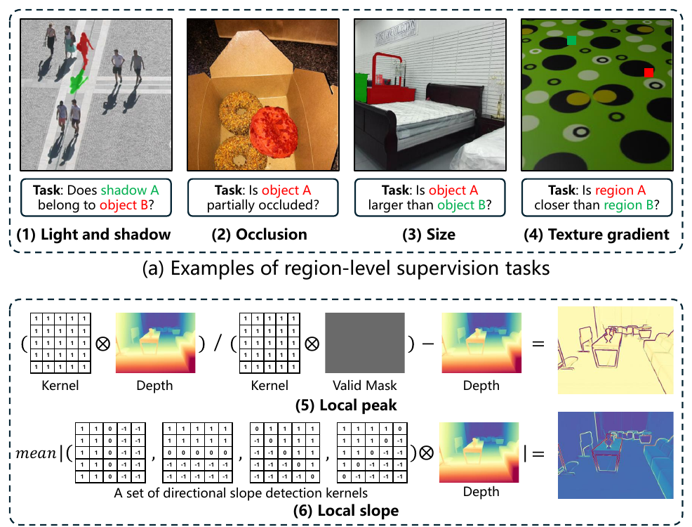
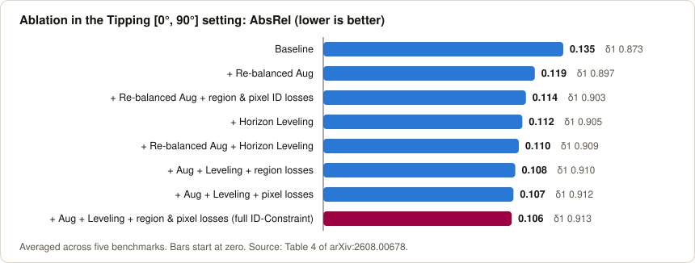
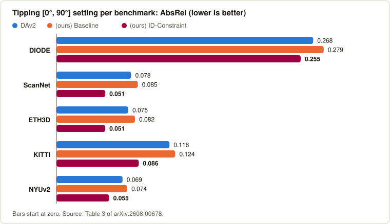
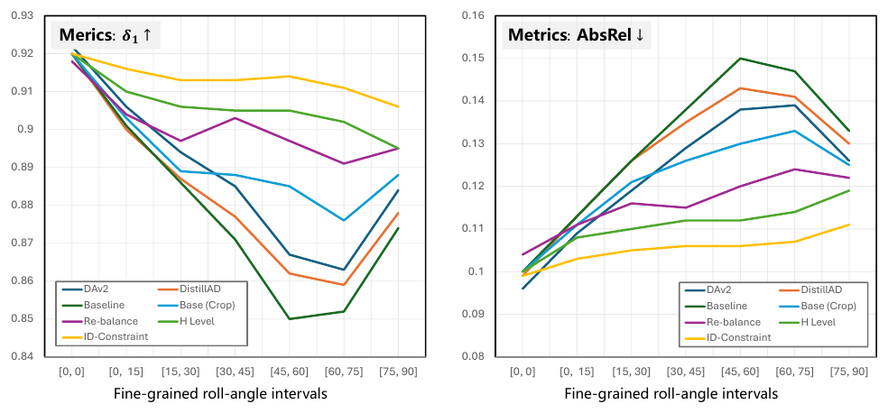

# Breaking the Horizontal Prior: Roll-Robust Monocular Depth Estimation with the Invariant Depth Constraint (ID-Constraint)

[](https://arxiv.org/abs/2608.00678)
[](https://kaihuatang.github.io/Horizontal-Prior/)
[](LICENSE)

Official repository of the arXiv preprint **[Breaking the Horizontal Prior: From Long-Tailed Orientation Bias to Roll-Robust Monocular Depth Estimation](https://arxiv.org/abs/2608.00678)** by Kaihua Tang, Ziqing Xia, Xiaoxu Zheng, Xiaoxue Zhang, Michael Bi Mi, Zhan Xu and Dave Zhenyu Chen (Tongji University; Huawei Technologies Ltd.). The paper is currently under review; the arXiv version is the only public version.

[Paper (arXiv)](https://arxiv.org/abs/2608.00678) | [PDF](https://arxiv.org/pdf/2608.00678) | [Project Page](https://kaihuatang.github.io/Horizontal-Prior/) | [中文简介](#中文简介)

<p align="center"></p>

<p align="center"><sub><b>The Horizontal Prior</b> (Figure 1 of the paper). (a) Depth predictions degrade on a rolled image; (b) random real-world images are mostly horizontal; (c) the average depth map and (d) the long-tailed distribution of absolute roll angle of 20K random real-world images.</sub></p>

> **Release status (please read).** Due to the confidentiality policy of the company where this work was carried out, and because the author who maintains this repository has since left that company, **all trained checkpoints and most of the code (including all training code) cannot be released or taken outside the company.** This repository contains everything that could be released: the roll-robustness **evaluation benchmark code**, the inference-time model definitions, the paired-bootstrap analysis script, and the data-list preparation scripts. See [What is released and what is not](#what-is-released-and-what-is-not) for the exact list.

## TL;DR

- **The Horizontal Prior** is the phenomenon that naturally collected real-world images are captured in approximately horizontal orientations, which produces a long-tailed distribution of absolute camera roll angles. Monocular depth estimation (MDE) models trained on such data degrade on rolled (tilted, rotated) images; the paper presents it as a new source of long-tailed distribution bias in MDE.
- **The degradation is measurable on current depth foundation models.** For Depth Anything V2 (DAv2), AbsRel rises from 0.096 to 0.127 (32% worse) and δ1 falls from 0.922 to 0.883 when the test images go from the Horizontal (0°) setting to the Tipping [0°, 90°] setting (Table 2 and Appendix E of the paper). Marigold, GenPercept and Distill Any Depth (DistillAD) degrade as well, and the paper shows qualitative failures of PromptDA and Depth Anything 3.
- **Two intuitive remedies** borrowed from long-tailed classification are studied: *re-balanced augmentation* (random rotation of training images) and *horizon leveling* (predict the roll angle, rotate the image back). Both give partial improvements.
- **Invariant Depth Constraint (ID-Constraint)** is a training-time supervision strategy that fine-tunes the DAv2 backbone (DINOv2 ViT-L encoder + DPT head) jointly with six rotation-invariant auxiliary tasks: four region-level tasks from the DepthCues benchmark (light and shadow, occlusion, size, texture gradient) and two new pixel-level tasks (local peak, local slope). The auxiliary prediction heads (ID Heads) are discarded after training, so the inference architecture is unchanged.
- **A roll-robustness benchmark for MDE**: five datasets (DIODE, ScanNet, ETH3D, KITTI, NYUv2) evaluated under four roll settings, Horizontal (0°), Shaking [0°, 15°], Rolling [0°, 45°] and Tipping [0°, 90°]. The evaluation code of this benchmark is what this repository releases.

## Citation

```bibtex
@misc{tang2026breakinghorizontalpriorlongtailed,
      title={Breaking the Horizontal Prior: From Long-Tailed Orientation Bias to Roll-Robust Monocular Depth Estimation}, 
      author={Kaihua Tang and Ziqing Xia and Xiaoxu Zheng and Xiaoxue Zhang and Michael Bi Mi and Zhan Xu and Dave Zhenyu Chen},
      year={2026},
      eprint={2608.00678},
      archivePrefix={arXiv},
      primaryClass={cs.CV},
      url={https://arxiv.org/abs/2608.00678}, 
}
```

## Key results

All numbers are copied from the paper (arXiv:2608.00678v1). AbsRel: lower is better; δ1: higher is better.

<p align="center"></p>

**Table 2 of the paper**: four roll settings, AbsRel ↓ / δ1 ↑, averaged over all valid test samples of the five benchmarks. **Bold** marks the best result as in the paper; `*` marks public models evaluated with our re-implemented evaluation code.

| Method | Horizontal (0°) | Shaking [0°, 15°] | Rolling [0°, 45°] | Tipping [0°, 90°] |
|---|---|---|---|---|
| Marigold* | 0.130 / 0.886 | 0.146 / 0.859 | 0.171 / 0.814 | 0.200 / 0.765 |
| GenPercept* | 0.130 / 0.891 | 0.143 / 0.869 | 0.164 / 0.830 | 0.185 / 0.794 |
| DAv2* | **0.096** / **0.922** | 0.109 / 0.906 | 0.119 / 0.895 | 0.127 / 0.883 |
| DistillAD* | 0.099 / 0.920 | 0.113 / 0.900 | 0.124 / 0.889 | 0.131 / 0.878 |
| (ours) Baseline | 0.100 / 0.920 | 0.113 / 0.901 | 0.125 / 0.887 | 0.135 / 0.873 |
| (ours) Re-balanced Aug | 0.104 / 0.918 | 0.111 / 0.904 | 0.114 / 0.901 | 0.119 / 0.897 |
| (ours) Horizon Leveling | 0.100 / 0.920 | 0.108 / 0.910 | 0.110 / 0.907 | 0.112 / 0.905 |
| (ours) ID-Constraint | 0.099 / 0.920 | **0.103** / **0.916** | **0.104** / **0.915** | **0.106** / **0.913** |

- **ID-Constraint is the best method in the three rolled settings** (Shaking, Rolling, Tipping) of Table 2. In the Horizontal setting DAv2 is best (0.096 / 0.922 vs. 0.099 / 0.920); the paper attributes this gap to the weaker performance of the re-implemented baseline.
- **Robustness to roll.** From Horizontal to Tipping, the AbsRel of ID-Constraint changes from 0.099 to 0.106, while DAv2 changes from 0.096 to 0.127 and our re-implemented baseline from 0.100 to 0.135 (Table 2).
- **Inference cost (Appendix E).** ID-Constraint adds zero inference parameters because the auxiliary heads are used only during training. The only additional inference cost is horizon leveling, which uses a ViT-S roll-angle predictor (about 21M parameters) and adds 15.4 ms latency on one A100 with batch size 1.
- **Statistical reliability (Appendix E).** With a paired bootstrap (1K per-image resamples) on Tipping, ID-Constraint vs. augmentation + leveling gives Δδ1 = +0.004 with 95% CI [0.0026, 0.0052] and ΔAbsRel = −0.004 with 95% CI [−0.0047, −0.0031].
- **Roll-angle estimation from a single image is hard.** The best roll-angle predictor in Table 1 has a mean error of 25.90° on the test data (five benchmarks, Tipping scenario); adapting PerspectiveFields improves it to 18.7° (Appendix E).

<p align="center"></p>

<p align="center"><sub><b>Qualitative comparison</b> (Figure 4 of the paper) under the four roll settings. PromptDA takes an additional low-resolution ground-truth depth map as input. The small grayscale images are absolute error maps with respect to each model's horizontal prediction.</sub></p>

<p align="center"></p>

<p align="center"><sub><b>Depth Anything 3 is affected too</b> (Figure 9 of the paper, qualitative only). Depth maps were generated with its Hugging Face online demo; boundaries become fuzzy under the Rolling and Tipping settings.</sub></p>

## Method

### Problem: the Horizontal Prior

The paper samples 20,000 random images from SA-1B, estimates their roll angles and finds a long-tailed distribution of absolute roll angle (Figure 1 above and Appendix C of the paper). Roll robustness of an MDE model *f* is defined in Appendix E as f(T<sub>θ</sub>(I)) ≈ T<sub>θ</sub>(f(I)) for an in-plane rotation T<sub>θ</sub> with θ > 0°, and degradation is measured with standard depth metrics. The problem was found in a real-world application: in mobile-captured indoor scene reconstruction, rolled frames caused blurred boundaries (Figure 2 of the paper).

<p align="center"></p>

<p align="center"><sub><b>Why it matters</b> (Figure 2 of the paper): 3D reconstruction flaws caused by the horizontal prior in a real-world application, DAv2 depth vs. ID-Constraint depth.</sub></p>

### Baseline: distillation from DAv2

The baseline follows the distillation pipeline of Distill Any Depth (DistillAD) with Depth Anything V2 (ViT-Large) as the teacher. The student uses the same DINOv2 ViT-L encoder, takes four feature maps at layers 4, 11, 17 and 23, and decodes them with a DPT head. The loss is the distillation loss of DistillAD with global normalization (an L1 distance between the normalized student and teacher depth maps, Eq. 1 of the paper) plus the gradient matching loss of MiDaS and DAv2, computed in the affine-invariant inverse depth space.

### Two intuitive remedies

1. **Re-balanced augmentation.** Each training image is rotated by an angle uniformly sampled from [−90°, 90°], together with a random center crop that keeps 40% to 100% of the original image size to avoid shortcut cues from padded boundaries; 10% of the samples are kept un-augmented (Appendix B).
2. **Horizon leveling.** A roll-angle prediction model (ViT-Small backbone; attention pooling, 1D batch norm, two linear layers, optional tanh) predicts the 2D vector (cos θ, sin θ), and the image is rotated back by the predicted angle. It is trained in two stages with data denoising: stage one treats SA-1B images as horizontal and uses the applied rotation as the label; stage two removes the half of the samples with the highest prediction error and re-trains (Table 1).

### Invariant Depth Constraint (ID-Constraint)

<p align="center"></p>

<p align="center"><sub><b>ID-Constraint</b> (Figure 3 of the paper): auxiliary ID Heads and ID Losses are used during training only.</sub></p>

ID-Constraint fine-tunes the DAv2 backbone with auxiliary **ID Heads** and **ID Losses** on rotated inputs, so that the ViT encoder is optimized jointly by the ID losses and the MDE losses. The ID losses are added to the final loss with weight 1.0, and the ID Heads are discarded at inference.

| # | Task | Level | Supervision | Loss | Prediction head |
|---|---|---|---|---|---|
| 1 | Light and shadow: does a shadow belong to an object? | region | DepthCues, 4,716 training samples | BCE | masked average pooling of two objects, feature difference, MLP |
| 2 | Occlusion: is an object partially occluded? | region | DepthCues, 24,402 samples | BCE | masked average pooling of one object, MLP |
| 3 | Size: which of two objects is larger? | region | DepthCues, 1,986 samples | BCE | same structure as task 1 |
| 4 | Texture gradient: which of two regions is farther? | region | DepthCues, 4,000 samples | BCE | same structure as task 1 |
| 5 | Local peak | pixel | computed from teacher depth on 20,000 SA-1B images | L1 | shared DPT head with hidden dimension 128 |
| 6 | Local slope | pixel | computed from teacher depth on 20,000 SA-1B images | L1 | shared DPT head with hidden dimension 128 |

<p align="center"></p>

<p align="center"><sub><b>The six auxiliary tasks</b> (Figure 6 of the paper): four region-level tasks whose labels do not change under rotation, and two pixel-level maps computed from depth.</sub></p>

The two pixel-level targets are computed from the teacher depth map of the horizontal image and then rotated together with the input:

```math
Z^{p} = (D^{t} \otimes K_{1}) / (M^{vp} \otimes K_{1}) - D^{t}
```

```math
Z^{s} = \frac{1}{4} \sum_{d} \left| D^{t} \otimes K_{d} \right|
```

where ⊗ is convolution, K₁ is a 5×5 kernel of ones, K_d ∈ {K↓, K→, K↘, K↙} are 5×5 directional slope-detection kernels, and Mᵛᵖ is the valid-pixel mask. The local peak map measures convex and concave structures (mean valid depth in a 5×5 neighborhood minus the pixel's depth); the local slope map is the mean absolute depth gradient along four directions. The paper chooses these two tasks because they are dense, local, compatible with affine-invariant depth, and rotation-invariant; surface normals are equivariant rather than invariant under image roll (Appendix E).

### Training configuration reported in the paper

| Item | Value (paper section) |
|---|---|
| MDE training data | 200,000 unlabeled SA-1B images (20 tar files `sa_000000.tar`, `sa_000050.tar`, ..., `sa_000950.tar`), pseudo depth labels from DAv2 (Implementation Details, Appendix B) |
| ID-Constraint data | 20,000 SA-1B images (pixel-level) + DepthCues subsets; light-shadow, size and texture-gradient upsampled 5×, 10× and 5×; about 107,842 effective samples per epoch (Appendix B) |
| Input size | resized and cropped to 560×560 |
| Optimizer | AdamW, learning rate 5×10⁻⁶ for the ViT encoder and 5×10⁻⁵ for the ID heads and DPT head; DPT head re-initialized before distillation |
| Schedule | MDE and ID-Constraint models: 1 epoch, batch size 8; roll-angle predictors: 5 epochs, batch size 64, L1 and/or cosine similarity loss |
| Environment | Python 3.12, PyTorch 2.7, TorchVision 0.22, one A100-SXM4-80GB GPU (Appendix D) |

## What is released and what is not

**Released in this repository**

- Evaluation of DAv2-architecture checkpoints under the four roll settings: `test.py`, `scripts/test_dav2.sh`, `scripts/test.sh`. This runs with the public Depth Anything V2 and Distill Any Depth checkpoints.
- Evaluation with horizon leveling: `test_hl.py` (requires a roll-angle predictor checkpoint, which is not released).
- Roll-rotated dataloaders and sample lists for DIODE, ScanNet, ETH3D, KITTI and NYUv2: `datasets/*.py`, `datasets/data_split/`.
- Inference-time model definitions: `models/dav2.py` (`DepthAnythingV2`), `models/depthcue.py` (`DepthCueModel`), `models/modules/cuehead.py` (`CueHead`: roll-angle head and region-level ID heads), `models/modules/dpthead.py` (`DPTHead`, `DPTHeadTiny`).
- Metrics (`utils/utils_metric.py`), paired stratified bootstrap confidence intervals (`paired_bootstrap.py`, `scripts/eval_confidence_interval.sh`).
- SA-1B subset download and list preparation: `datasets/prepare/`.
- Our evaluation code ported into other projects (GenPercept, Marigold) and visualization scripts (PromptDA, MoGe): `_eval_others/`.

**Not released (company confidentiality)**

- All trained checkpoints: the re-implemented baseline, the re-balanced augmentation model, the ID-Constraint model and the roll-angle prediction model.
- All training code: the distillation training loop and losses, the ID-Constraint training (ID Losses, local peak / local slope target generation), the DepthCues training dataloader (`datasets/depthcue.py`, mentioned in `datasets/README.md`, is not part of this repository) and the two-stage training of the roll-angle predictor.

Consequently, `scripts/test_baseline.sh`, `scripts/test_aug.sh`, `scripts/test_hl.sh` and `scripts/test_idcue_constraint.sh` are kept as a record of the evaluation protocol; they point to checkpoint paths (`./exp/...`, `./checkpoints/angle_prediction/latest.pth`) that you would have to produce yourself by re-training following the paper.

## Getting Started

- Data: please follow [`./datasets/README.md`](datasets/README.md) to prepare all evaluation datasets (DIODE, ETH3D, KITTI, NYUv2 and ScanNet, downloaded from the [GenPercept evaluation data on Hugging Face](https://huggingface.co/datasets/guangkaixu/genpercept_datasets_eval/tree/main)). **Before running, edit the dataset root paths** that are hard-coded in `test.py` and `test_hl.py` (`/home/couser/datasets/depth_datasets/...`).
- Environment: we recommend setting up a virtual environment to ensure package compatibility. You can use [miniconda](https://www.anaconda.com/docs/getting-started/miniconda/main) to set up the environment. The following steps show how to create and activate the environment, and install dependencies:

```bash
# Create a new conda environment with Python 3.10 
# (Other versions of python also work in most of the cases)
conda create -n idcue -y python=3.10

# Activate the created environment
conda activate idcue

# Install the required Python packages
pip install -r requirements.txt
```

The experiments in the paper were run with Python 3.12, PyTorch 2.7 and TorchVision 0.22 on a single A100-SXM4-80GB GPU (Appendix D); `requirements.txt` does not pin versions.

## Checkpoints

For ease of management, we recommend placing all downloaded ckpt files in the "checkpoints" folder under this directory. However, as long as you specify the absolute path to the ckpt file in the corresponding test ".sh" scripts, you can actually store the checkpoints in any accessible location on the server.

- For Depth Anything V2, you can download all checkpoints from links in [their official github repo](https://github.com/DepthAnything/Depth-Anything-V2). We adopt Depth-Anything-V2-Large (335.3M) in our evaluation.
- For Distill Any Depth, their checkpoints can be downloaded from [their github repo](https://github.com/Westlake-AGI-Lab/Distill-Any-Depth) as well. `utils/utils_general.py` loads their `.safetensors` file directly; see the commented `ckpt_path` lines in `scripts/test.sh`.
- Our own checkpoints (baseline, re-balanced augmentation, ID-Constraint, roll-angle predictor) are **not available**, see [Release status](#what-is-released-and-what-is-not).

## Evaluation

The evaluation scripts are located in the "./scripts" directory. Please note that neither Depth-Anything-v2 nor Distill-Any-Depth has released their official evaluation code. Consequently, we re-implemented these protocols; therefore, our results may differ slightly from those reported in the original papers. Each run evaluates the four roll settings (0, 0), (0, 15), (0, 45), (0, 90) on all five datasets and writes `per_sample_rotate_{lo}_{hi}.csv` to the save path.

1. Evaluate Depth-Anything-v2 (runs with the public DAv2 ViT-L checkpoint, image size 518)
```bash
bash ./scripts/test_dav2.sh
```

2. Evaluate reproduced baseline (checkpoint not released)
```bash
bash ./scripts/test_baseline.sh
```

3. Evaluate baseline model with Re-balanced Augmentation (checkpoint not released)
```bash
bash ./scripts/test_aug.sh
```

4. Evaluate baseline model with Horizontal Leveling, called horizon leveling in the paper (checkpoints not released)
```bash
bash ./scripts/test_hl.sh
```

5. Evaluate the ID-Constraint model with horizon leveling (checkpoints not released)
```bash
bash ./scripts/test_idcue_constraint.sh
```

6. Paired bootstrap 95% confidence intervals between two evaluated methods (edit the two CSV paths in the script to your save paths first)
```bash
bash ./scripts/eval_confidence_interval.sh
```

## Evaluation Other Methods

We also put our evaluation codes into other projects, such as GenPercept, Marigold, and PromptDA (visualization only). Please refer to the "./_eval_others" folder for these scripts. The folder also contains a MoGe visualization script.

## Confidentiality Policy of the Company

Due to the confidentiality reasons of the company, all checkpoints and most of the codes are not allowed to release or send to the external network. The author who maintains this repository has left the company and no longer has access to them. We are sorry for the inconvenience; the paper describes the training procedure and hyper-parameters in detail (Implementation Details, Appendix B and Appendix D).

## More results

All numbers are copied from arXiv:2608.00678v1. Marigold and GenPercept operate in depth space; DAv2, DistillAD and our models are evaluated in disparity (inverse-depth) space.

### Ablation (Table 4, Tipping setting)

<p align="center"></p>

**Ablation (Table 4, Tipping).** Baseline 0.135 / 0.873; re-balanced augmentation 0.119 / 0.897; re-balanced augmentation + region and pixel ID losses 0.114 / 0.903; horizon leveling alone 0.112 / 0.905; augmentation + leveling 0.110 / 0.909; full configuration 0.106 / 0.913. The `(ours) ID-Constraint` row of Tables 2 and 3 coincides with this full configuration, i.e. it uses re-balanced augmentation during training and horizon leveling at inference; accordingly `scripts/test_idcue_constraint.sh` evaluates with `test_hl.py`.

| Re-balanced Aug | Horizon Leveling | Region Losses | Pixel Losses | ID-Constraint | AbsRel ↓ | δ1 ↑ |
|:-:|:-:|:-:|:-:|:-:|---|---|
|  |  |  |  |  | 0.135 | 0.873 |
| ✓ |  |  |  |  | 0.119 | 0.897 |
| ✓ |  | ✓ | ✓ | ✓ | 0.114 | 0.903 |
|  | ✓ |  |  |  | 0.112 | 0.905 |
| ✓ | ✓ |  |  |  | 0.110 | 0.909 |
| ✓ | ✓ | ✓ |  | ✓ | 0.108 | 0.910 |
| ✓ | ✓ |  | ✓ | ✓ | 0.107 | 0.912 |
| ✓ | ✓ | ✓ | ✓ | ✓ | **0.106** | **0.913** |

### Per-benchmark results in the hardest setting (Table 3, Tipping [0°, 90°], AbsRel ↓ / δ1 ↑)

<p align="center"></p>

| Method | DIODE | ScanNet | ETH3D | KITTI | NYUv2 |
|---|---|---|---|---|---|
| Marigold* | 0.337 / 0.705 | 0.133 / 0.832 | 0.129 / 0.842 | 0.246 / 0.613 | 0.125 / 0.854 |
| GenPercept* | 0.337 / 0.715 | 0.113 / 0.871 | 0.114 / 0.877 | 0.225 / 0.633 | 0.103 / 0.895 |
| DAv2* | 0.268 / 0.736 | 0.078 / 0.938 | 0.075 / 0.941 | 0.118 / 0.873 | 0.069 / 0.957 |
| DistillAD* | 0.271 / 0.735 | 0.079 / 0.939 | 0.080 / 0.932 | 0.124 / 0.863 | 0.074 / 0.952 |
| (ours) Baseline | 0.279 / 0.732 | 0.085 / 0.923 | 0.082 / 0.929 | 0.124 / 0.863 | 0.074 / 0.950 |
| (ours) Re-balanced Aug | 0.263 / 0.748 | 0.058 / 0.967 | 0.068 / 0.957 | 0.115 / 0.877 | 0.062 / 0.967 |
| (ours) Horizon Leveling | 0.262 / 0.745 | 0.061 / 0.958 | 0.057 / 0.967 | 0.087 / 0.927 | 0.061 / 0.962 |
| (ours) ID-Constraint | **0.255** / **0.753** | **0.051** / **0.971** | **0.051** / **0.972** | **0.086** / **0.931** | **0.055** / **0.971** |

### Fine-grained roll intervals

<p align="center"></p>

<p align="center"><sub>Figure 5 of the paper: results averaged across five benchmarks on fine-grained roll intervals. H Level means horizon leveling; Base (Crop) crops each rotated image to the original resolution, showing that the degradation is not only a resolution artifact. The rebound near 90° corresponds to a small peak near 90° in the training distribution (photos that were never horizontally corrected, Appendix C).</sub></p>

Table 1 (roll-angle prediction models) and Tables 5 to 7 (per-benchmark results for the Horizontal, Shaking and Rolling settings) are available on the [project page](https://kaihuatang.github.io/Horizontal-Prior/#results) and in Appendix D of the paper.

## Repository structure

| Path | Content |
|---|---|
| `test.py` | Evaluation of a DAv2-architecture checkpoint on the five benchmarks under the four roll settings; writes logs and per-image CSV files to `--save-path` |
| `test_hl.py` | Same evaluation with horizon leveling (`--angle-path` is the roll-angle predictor checkpoint) |
| `paired_bootstrap.py` | Paired stratified bootstrap 95% confidence intervals between two methods from their per-image CSV files |
| `scripts/` | `test_dav2.sh`, `test.sh`, `test_baseline.sh`, `test_aug.sh`, `test_hl.sh`, `test_idcue_constraint.sh`, `eval_confidence_interval.sh` |
| `models/` | `dav2.py`, `depthcue.py`, `dinov2.py`, `modules/` (DINOv2 blocks, DPT heads, `CueHead`) |
| `datasets/` | Evaluation dataloaders with roll rotation, `data_split/` sample lists, `prepare/` SA-1B download and list scripts, `README.md` with data instructions |
| `utils/` | Checkpoint loading (`.pth` and Distill Any Depth `.safetensors`), logger, metrics |
| `_eval_others/` | `GenPercept/` and `Marigold/` with our roll evaluation ported in; `PromptDA/` and `MoGe/` visualization scripts. Third-party code keeps its original license files. |
| `HorizontalPrior.pdf` | The arXiv v1 PDF of the paper |
| `checkpoints/` | Empty placeholder for downloaded checkpoints |

## Paper-to-code map (released parts only)

<details>
<summary>Click to expand: where each concept of the paper lives in the released code</summary>

| Paper concept | Code |
|---|---|
| DAv2-architecture MDE model, ViT-L features from layers 4, 11, 17, 23 | `models/dav2.py`: `DepthAnythingV2`, `intermediate_layer_idx['vitl'] = [4, 11, 17, 23]` |
| Four roll settings Horizontal / Shaking / Rolling / Tipping | `test.py`, `test_hl.py`: `for rotate_range in ((0, 0), (0, 15), (0, 45), (0, 90))` |
| Seven fine-grained 15° intervals (Figure 5, Figure 8) | the commented `rotate_range` line above it: `(0, 0), (0, 15), (15, 30), ..., (75, 90)` |
| Rotation of test images, depth maps and masks (nearest-neighbor) | `get_sample_with_angle()` in `datasets/diode.py`, `scannet.py`, `eth3d.py`, `kitti.py`, `nyuv2.py`; the rotation angle of each test sample is assigned in `__getitem__()` |
| Base (Crop) setting | `SAME_AREA` flag in `test.py` / `test_hl.py`, passed as `same_area` to the dataloaders |
| Scale- and shift-invariant evaluation in disparity (inverse-depth) space | `test.py`: `depth = 1 / depth`, least-squares alignment with `np.linalg.lstsq`, clamping to the dataset's valid range |
| Valid depth ranges: DIODE [0.6, 350], ScanNet [1e-3, 10], ETH3D [1e-5, ∞), KITTI [1e-5, 80], NYUv2 [1e-3, 10]; images with fewer than 100 valid pixels are excluded | `min_depth` / `max_depth` in each dataset class; `if valid_mask.sum().item() < 100` in `test.py` |
| Metrics AbsRel and δ1 (plus δ2, δ3, SqRel, RMSE, RMSE-log, log10, SILog) | `utils/utils_metric.py`: `eval_depth()` |
| Averages over the five benchmarks | `test.py` sums per-image metrics over all datasets and divides by the number of valid samples (771 + 800 + 454 + 652 + 654 = 3,331 images according to Appendix B) |
| Horizon leveling at inference | `test_hl.py`: `angle_model` predicts (cos, sin), `pred_deg = arctan2(sin, cos)`, the sample is re-loaded with angle `rotate_angle − pred_deg` and fed to the depth model |
| Roll-angle prediction model (ViT-S, attention pooling, 1D batch norm, two linear layers, tanh) | `models/depthcue.py`: `DepthCueModel(encoder='vits', hidden_dim=768, layers=[8, 11])` with task `angle`; `models/modules/cuehead.py`: `CueHead.angle_head`, `AttentionPoolLatent` |
| Region-level ID Heads (light and shadow, occlusion, size, texture gradient) | `models/modules/cuehead.py`: branches `lightshadow`, `occlusion`, `size`, `texturegrad` of `CueHead` (the file also defines an `elevation` head, which is not one of the four rotation-invariant tasks used in the paper) |
| Paired bootstrap confidence intervals (Appendix E) | `paired_bootstrap.py`, `scripts/eval_confidence_interval.sh`; per-image CSVs `per_sample_rotate_{lo}_{hi}.csv` are written by `test.py` / `test_hl.py` |
| SA-1B subset of 20 tar files | `datasets/prepare/download_sa1b.py`, `datasets/prepare/prepare_list.py` |

</details>

## Acknowledgements

- Our evaluation code is built following [DPT](https://github.com/isl-org/DPT/blob/main/EVALUATION.md), [Depth Anything V2](https://github.com/DepthAnything/Depth-Anything-V2), [GenPercept](https://github.com/aim-uofa/GenPercept) and [monodepth2](https://github.com/nianticlabs/monodepth2); evaluation in disparity space follows Depth Anything. The evaluation data and sample lists come from GenPercept. Thank you so much for their great work!
- The model code is based on [Depth Anything V2](https://github.com/DepthAnything/Depth-Anything-V2) and DINOv2; the baseline follows [Distill Any Depth](https://github.com/Westlake-AGI-Lab/Distill-Any-Depth); the region-level tasks and heads follow [DepthCues](https://huggingface.co/datasets/danier97/depthcues); `_eval_others/` contains code from [GenPercept](https://github.com/aim-uofa/GenPercept) and [Marigold](https://github.com/prs-eth/Marigold).
- Funding (from the paper): this work was supported by the Fundamental Research Funds for the Central Universities at Tongji University under Grant No. 22120260376.

## 中文简介

本仓库是 arXiv 论文 **Breaking the Horizontal Prior: From Long-Tailed Orientation Bias to Roll-Robust Monocular Depth Estimation**（[arXiv:2608.00678](https://arxiv.org/abs/2608.00678)，目前在投稿中，仅有 arXiv 版本）的官方仓库。

- **水平先验（Horizontal Prior）**：自然采集的真实图像绝大多数是接近水平拍摄的，绝对滚转角（roll angle）呈长尾分布（long-tailed distribution）。在这种数据上训练的单目深度估计（Monocular Depth Estimation, MDE）模型，在画面发生滚转（相机倾斜、旋转）时精度明显下降。
- **问题有多严重**：Depth Anything V2（DAv2）从 Horizontal (0°) 到 Tipping [0°, 90°] 设置，AbsRel 从 0.096 升到 0.127（变差 32%），δ1 从 0.922 降到 0.883（论文 Table 2 与附录 E）。Marigold、GenPercept、Distill Any Depth 同样退化。
- **两种直观方案**：再平衡旋转增强（re-balanced augmentation）与水平校正（horizon leveling，先预测滚转角再把图像转正），都只能部分缓解。
- **不变深度约束（Invariant Depth Constraint, ID-Constraint）**：一种仅在训练阶段使用的监督策略，用 6 个旋转不变的辅助任务（4 个来自 DepthCues 的区域级任务：光影、遮挡、大小、纹理梯度；2 个新提出的像素级任务：local peak、local slope）与深度损失联合微调 DAv2 的 ViT 主干；推理时丢弃辅助头，网络结构与推理参数量不变。
- **主要结果**（Table 2，五个数据集 DIODE、ScanNet、ETH3D、KITTI、NYUv2 的平均，AbsRel / δ1）：ID-Constraint 在 Shaking、Rolling、Tipping 三种滚转设置下均为最优，分别为 0.103 / 0.916、0.104 / 0.915、0.106 / 0.913；Tipping 设置下 DAv2 为 0.127 / 0.883，我们复现的基线为 0.135 / 0.873。Horizontal 设置下 DAv2 最优（0.096 / 0.922），ID-Constraint 为 0.099 / 0.920。
- **关于开源范围的说明**：由于公司保密规定，且维护本仓库的作者已从该公司离职，**所有模型权重以及大部分代码（包括全部训练代码）无法开源，也无法带出公司**。本仓库公开的是可以公开的部分：四种滚转设置下的评测代码（`test.py`、`test_hl.py`、五个数据集的旋转评测 dataloader）、推理所需的模型结构定义、paired bootstrap 置信区间脚本，以及 SA-1B 数据列表准备脚本。使用公开的 DAv2 / Distill Any Depth 权重即可运行 `scripts/test_dav2.sh` 复现对应基准评测。

## Keywords

monocular depth estimation, horizontal prior, camera roll robustness, long-tailed orientation bias, rotation-invariant auxiliary tasks, Invariant Depth Constraint (ID-Constraint), horizon leveling, Depth Anything V2, DINOv2, DepthCues

单目深度估计，水平先验，相机滚转鲁棒性，长尾分布偏差，旋转不变辅助任务，不变深度约束，水平校正，深度基础模型
